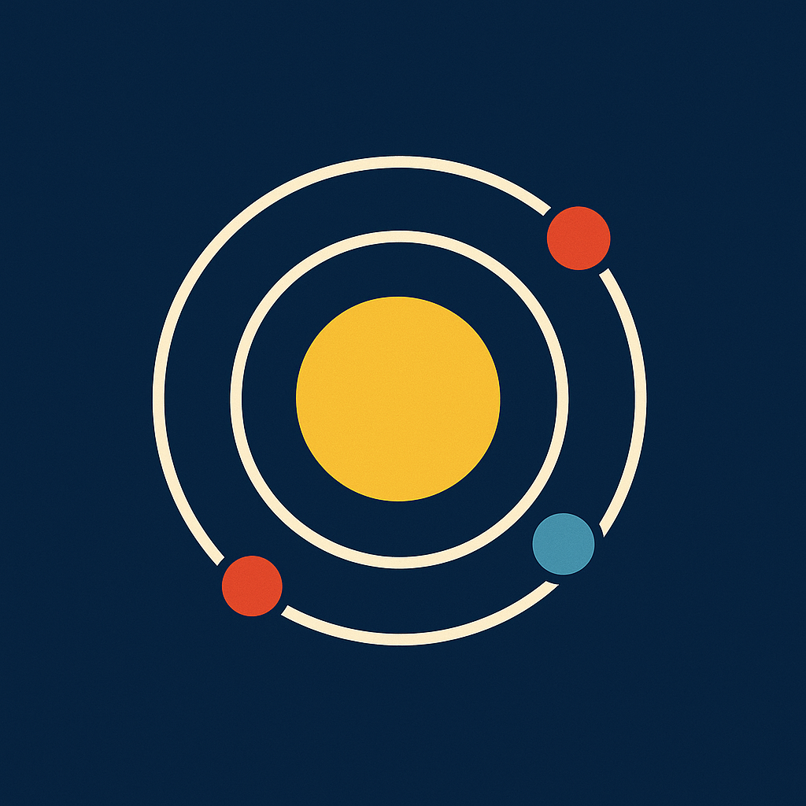
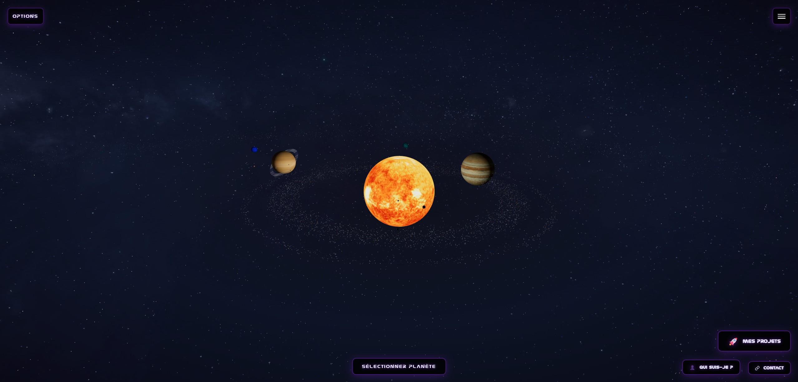

<p align="center">
  
</p>

# Portfolio Solaire 🌌 🪐

<p align="right">
    <b>Langues:</b>
    <a href="./README.fr.md">🇫🇷 Français</a> |
    <a href="./README.md">🇬🇧 English</a>
</p>

Portfolio Solaire est un système solaire 3D interactif construit avec **React, Three.js et TypeScript**.  
Il permet aux utilisateurs d'explorer le système solaire, de suivre les planètes et les lunes, et de découvrir mon univers et mes projets dans un environnement spatial immersif.

---

## 📑 Table des matières

1. [🎯 Objectifs du projet](#-objectifs-du-projet)  
2. [🧩 Stack & Principes](#-stack--principes)  
3. [🚀 Installation & Lancement](#-installation--lancement)  
4. [🗂️ Structure du projet](#️-structure-du-projet-frontend)  
5. [🌟 Fonctionnalités clés](#-fonctionnalités-clés)  
6. [🌐 Intégration API](#-intégration-api)  
7. [🎨 Optimisations de performance](#-optimisations-de-performance)  
8. [🔒 Licence](#-licence)  
9. [👤 Auteur](#-auteur)  
10. [🙏 Remerciements](#-remerciements)

---

<div align="center">

<!-- Languages / Formats -->


<br/>

<!-- Frameworks / Libraries -->


<br/>


<br/>

<!-- Tools / Build -->


<br/>

<!-- Versioning / Environment -->


<br/>

<!-- Hosting / License -->

<a href="./LICENSE">
  
</a>

<br/>

<div align="center">
    <!-- Maquette -->
    
</div>

</div>

<br>

<div align="center">
<a href="https://portfolio-the-milky-way-solar-system.netlify.app/">
  🌐 Portfolio Solaire Démo 🌐
</a>
</div>

---

## 🎯 Objectifs du projet

- Créer un système solaire 3D immersif utilisant Three.js et React Three Fiber pour présenter mon travail et mes compétences.
- Afficher 9 planètes avec textures réalistes, inclinaisons orbitales, et 24 lunes.
- Implémenter des contrôles de caméra fluides pour suivre les corps célestes avec zoom ajustable et transitions.
- Récupérer les positions des planètes en temps réel depuis l'API Horizons de la NASA pour des données astronomiques précises.
- Construire des labels interactifs pour les planètes et les lunes avec modales d'informations détaillées.
- Intégrer des modales pour les projets (intégration GitHub), la section à propos, et le formulaire de contact (EmailJS).
- Fournir des options d'affichage pour les orbites, les labels et les ceintures d'astéroïdes (Ceinture principale, Ceinture co-orbitale de Jupiter, Ceinture de Kuiper).
- Utiliser Redux Toolkit pour la gestion d'état centralisée à travers l'application.
- Assurer une expérience 3D entièrement responsive et performante sur tous les appareils.

---

## 🧩 Stack & Principes

- **React + TypeScript + Vite** (SPA avec typage fort)
- **Three.js + React Three Fiber** (moteur de rendu 3D)
- **React Three Drei** (utilitaires et helpers 3D)
- **Redux Toolkit** (gestion d'état)
- **Sass/SCSS** (styles modulaires)
- **EmailJS** (intégration formulaire de contact)
- **API Horizons NASA** (positions réelles des planètes)
- **ESLint** (qualité du code)

---

## 🚀 Installation & Lancement

### 1) Frontend (React + Vite)

```bash
# Cloner le dépôt
git clone https://github.com/Tigershark936/Portfolio_The_Milky_Way_Solar_System.git
cd portfolio-solaire

# Installer les dépendances
npm install

# Démarrer le projet
npm run dev

👉 Application disponible sur : http://localhost:5173
```

### 2) Build pour la production

```bash
npm run build

# Prévisualiser le build de production
npm run preview
```

---

## 🗂️ Structure du projet (Frontend)

```
portfolio-solaire/

├── public/                      # Ressources statiques publiques
│   ├── fonts/                   # Polices personnalisées (Nasa.ttf)
│   ├── logos/                   # Logos des technologies
│   ├── projects/                # Captures d'écran des projets
│   ├── textures/                # Textures des planètes, lunes et soleil
│   │   ├── planets/
│   │   ├── moons/
│   │   └── nebula.jpg
│   ├── icone-site.png           # Favicon du site
│   └── favicon_32x32.png
│
├── src/
│   ├── components/
│   │   ├── AsteroidBelt/        # Rendu des ceintures d'astéroïdes avec meshes instanciés
│   │   ├── Moon/                # Composant Lune
│   │   ├── Nebula/              # Effet de nébuleuse en arrière-plan
│   │   ├── Orbit/               # Trajectoires orbitales avec inclinaisons
│   │   ├── Planet/              # Composant Planète avec textures
│   │   ├── SolarSystem/         # Orchestrateur principal du système solaire
│   │   ├── Sun/                 # Composant Soleil avec effet de lueur
│   │   ├── TwinklingStars/      # Champ d'étoiles animé
│   │   └── UI/
│   │       ├── About/           # Modale et bouton À propos
│   │       ├── Camera/          # Contrôles de suivi de caméra
│   │       ├── Contact/         # Modale et bouton Contact
│   │       ├── Labels/          # Gestionnaire de labels pour planètes et lunes
│   │       ├── Menu/            # Menu des options d'affichage
│   │       ├── PlanetInfo/      # Modale d'informations planète
│   │       ├── Project/         # Modale Projets avec intégration GitHub
│   │       └── Selectors/       # Sélecteurs planètes/lunes
│   │
│   ├── data/
│   │   └── planetPositionsApi.ts  # Intégration API Horizons NASA
│   │
│   ├── features/                # Slices Redux
│   │   ├── camera/
│   │   ├── selection/
│   │   ├── solarSystem/
│   │   └── visualization/
│   │
│   ├── hooks/                   # Hooks React personnalisés
│   │   ├── useFetchPlanetPositions.ts
│   │   └── useRedux.ts
│   │
│   ├── pages/                   # Pages principales
│   │   ├── HomePage/
│   │   └── LoadingPage/
│   │
│   ├── store/                   # Configuration du store Redux
│   │   └── store.ts
│   │
│   ├── types/                   # Définitions de types TypeScript
│   │   └── SolarSystemDetails.ts
│   │
│   ├── utils/                   # Fonctions utilitaires
│   │   └── texturePreloader.ts
│   │
│   ├── App.tsx                  # Composant racine
│   ├── main.tsx                 # Point d'entrée React
│   └── global.scss              # Styles SCSS globaux
│
├── .gitignore                   # Liste des fichiers ignorés
├── eslint.config.js             # Configuration ESLint
├── vite.config.ts               # Configuration Vite
├── tsconfig.json                # Configuration TypeScript
├── tsconfig.app.json
├── tsconfig.node.json
├── package.json                 # Dépendances du projet & scripts
├── package-lock.json
├── LICENSE                      # Licence MIT
├── README.md                    # Documentation du projet (Anglais)
└── README.fr.md                 # Documentation du projet (Français)
```

---

## 🌟 Fonctionnalités clés

### 🪐 Système solaire interactif
- **9 planètes** (Mercure à Pluton) avec textures réalistes et ratios de taille précis.
- **24 lunes** en orbite autour de leurs planètes respectives avec textures individuelles.
- **Inclinaisons orbitales réelles** pour une représentation scientifiquement exacte.
- **3 ceintures d'astéroïdes** : Ceinture principale (Mars-Jupiter), Ceinture co-orbitale de Jupiter et Ceinture de Kuiper.
- **Soleil** avec effet de lueur et surface solaire animée.
- **Champ d'étoiles scintillant** et fond de nébuleuse pour une atmosphère spatiale immersive.

### 🎮 Contrôles de caméra
- **Mode suivi** pour les planètes et les lunes avec transitions fluides et niveaux de zoom ajustables.
- **Contrôles manuels** utilisant souris/trackpad (orbite, panoramique, zoom).
- **Bouton de réinitialisation** de la caméra pour revenir à la vue initiale.
- **Ajustement automatique du zoom** basé sur la taille du corps céleste pour une visualisation optimale.

### 🏷️ Labels & Informations
- **Labels au survol** affichant les noms des planètes en temps réel au passage de la souris.
- **Labels des lunes** affichés lorsque le bouton "Noms des lunes" est activé.
- **Modale d'informations planète** avec données détaillées : taille, distance du soleil, période orbitale, période de rotation, et plus.
- **Contrôles d'activation** pour les labels de planètes et de lunes indépendamment.

### 🎨 Options d'affichage
- **Activation/désactivation de la visibilité des orbites** pour afficher ou masquer les trajectoires planétaires.
- **Activation/désactivation des labels** pour les planètes et les lunes séparément.
- **Activation/désactivation des ceintures d'astéroïdes** pour activer ou désactiver leur rendu.
- **Mode temps réel** vs **temps accéléré** pour les animations orbitales.

### 📂 Section Projets
- **Intégration GitHub automatique** récupérant les dépôts depuis mon profil.
- **Cartes de projets** avec images, descriptions et liens (GitHub, Démo, NPM).
- **Titres et descriptions personnalisés** pour chaque projet avec fallback vers les données GitHub.

### 📧 Formulaire de contact
- **Intégration EmailJS** pour l'envoi de messages directs sans backend.
- **Validation du formulaire** avec retour utilisateur et gestion des erreurs.
- **Design responsive** optimisé pour toutes les tailles d'écran.

### ℹ️ Section À propos
- **Biographie personnelle** et présentation.
- **Présentation de la stack technologique** avec logos interactifs.
- **Liens vers les réseaux sociaux** (GitHub, LinkedIn, etc.).

---

## 🌐 Intégration API

Le projet intègre **l'API Horizons de la NASA** pour récupérer les positions des planètes en temps réel :

- Requêtes automatiques basées sur la date actuelle pour des positions planétaires précises.
- Fallback vers des données locales mockées si l'API est indisponible ou limitée en débit.
- Parsing des données d'éphémérides du système de la NASA pour des coordonnées précises.
- Conversion des unités astronomiques (UA) vers les unités de scène Three.js.

---

## 🎨 Optimisations de performance

- **Meshes instanciés** pour les ceintures d'astéroïdes (rendu efficace de milliers d'objets).
- **Préchargement des textures** pour éviter les délais de chargement pendant l'exécution.
- **Frustum culling désactivé** pour les objets distants afin d'assurer leur visibilité.
- **Lazy loading** des modales et composants lourds.
- **Mémoïsation** avec `useMemo` pour éviter les re-rendus inutiles.

---

## 🔒 Licence

Ce projet est sous licence MIT – voir le fichier [LICENSE](./LICENSE) pour plus de détails.

---

## 👤 Auteur

**Alain**  
Mon GitHub : [⚡ Retrouvez-moi sur GitHub ⚡](https://github.com/Tigershark936)

---

## 🙏 Remerciements

- **NASA** pour les textures des planètes et l'API Horizons.
- **Solar System Scope** pour les textures des lunes.
- Communautés **Three.js** et **React Three Fiber**.
- **OpenClassrooms** pour le parcours d'apprentissage.
