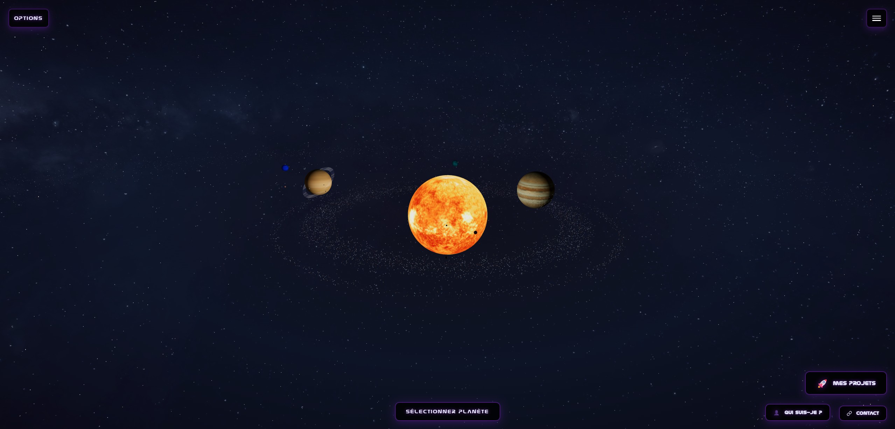

<p align="center">
  
</p>

# Portfolio Solaire 🌌 🪐

<p align="right">
    <b>Languages:</b>
    <a href="./README.fr.md">🇫🇷 Français</a> |
    <a href="./README.md">🇬🇧 English</a>
</p>

Portfolio Solaire is an interactive 3D solar system built with **React, Three.js, and TypeScript**.  
It allows users to explore the solar system, follow planets and moons, and discover my universe and projects in an immersive space environment.

---

## 📑 Table of Contents

1. [🎯 Project Objectives](#-project-objectives)  
2. [🧩 Stack & Principes](#-stack--principes)  
3. [🚀 Installation & Launch](#-installation--launch)  
4. [🗂️ Project Structure](#️-project-structure-frontend)  
5. [🌟 Key Features](#-key-features)  
6. [🌐 API Integration](#-api-integration)  
7. [🎨 Performance Optimizations](#-performance-optimizations)  
8. [🔒 License](#-license)  
9. [👤 Author](#-author)  
10. [🙏 Acknowledgments](#-acknowledgments)

---

<div align="center">

<!-- Languages / Formats -->


<br/>

<!-- Frameworks / Libraries -->


<br/>


<br/>

<!-- Tools / Build -->


<br/>

<!-- Versioning / Environment -->


<br/>

<!-- Hosting / License -->

<a href="./LICENSE">
  
</a>

<br/>

<div align="center">
    <!-- Maquette -->
    
</div>

</div>

<br>

<div align="center">
<a href="https://portfolio-the-milky-way-solar-system.netlify.app/">
  🌐 Portfolio Solaire Démo 🌐
</a>
</div>

---

## 🎯 Project objectives

- Create an immersive 3D solar system using Three.js and React Three Fiber to showcase my work and skills.
- Display 9 planets with realistic textures, orbital inclinations, and 24 moons.
- Implement smooth camera controls to follow celestial bodies with adjustable zoom and transitions.
- Fetch real-time planet positions from NASA's Horizons API for accurate astronomical data.
- Build interactive labels for planets and moons with detailed information modals.
- Integrate modals for projects (GitHub integration), about section, and contact form (EmailJS).
- Provide display options for orbits, labels, and asteroid belts (Main Belt, Jupiter Co-orbital, Kuiper Belt).
- Use Redux Toolkit for centralized state management across the application.
- Ensure a fully responsive and performant 3D experience across all devices.

---

## 🧩 Stack & Principes

- **React + TypeScript + Vite** (SPA with type safety)
- **Three.js + React Three Fiber** (3D rendering engine)
- **React Three Drei** (3D helpers and utilities)
- **Redux Toolkit** (state management)
- **Sass/SCSS** (modular styling)
- **EmailJS** (contact form integration)
- **NASA Horizons API** (real planet positions)
- **ESLint** (code quality)

---

## 🚀 Installation & Launch

### 1) Frontend (React + Vite)

```bash
# Clone repository
git clone https://github.com/Tigershark936/Portfolio_The_Milky_Way_Solar_System.git
cd portfolio-solaire

# Install dependencies
npm install

# Start project
npm run dev

👉 Application available at: http://localhost:5173
```

### 2) Build for production

```bash
npm run build

# Preview production build
npm run preview
```

---

## 🗂️ Project Structure (Frontend)

```
portfolio-solaire/

├── public/                      # Static public assets
│   ├── fonts/                   # Custom fonts (Nasa.ttf)
│   ├── logos/                   # Technology logos
│   ├── projects/                # Project screenshots
│   ├── textures/                # Planet, moon, and sun textures
│   │   ├── planets/
│   │   ├── moons/
│   │   └── nebula.jpg
│   ├── icone-site.png           # Site favicon
│   └── favicon_32x32.png
│
├── src/
│   ├── components/
│   │   ├── AsteroidBelt/        # Asteroid belt rendering with instanced meshes
│   │   ├── Moon/                # Moon component
│   │   ├── Nebula/              # Background nebula effect
│   │   ├── Orbit/               # Orbital paths with inclinations
│   │   ├── Planet/              # Planet component with textures
│   │   ├── SolarSystem/         # Main solar system orchestrator
│   │   ├── Sun/                 # Sun component with glow effect
│   │   ├── TwinklingStars/      # Animated starfield
│   │   └── UI/
│   │       ├── About/           # About modal and button
│   │       ├── Camera/          # Camera follow controls
│   │       ├── Contact/         # Contact modal and button
│   │       ├── Labels/          # Label manager for planets and moons
│   │       ├── Menu/            # Display options menu
│   │       ├── PlanetInfo/      # Planet info modal
│   │       ├── Project/         # Projects modal with GitHub integration
│   │       └── Selectors/       # Planet/moon selectors
│   │
│   ├── data/
│   │   └── planetPositionsApi.ts  # NASA Horizons API integration
│   │
│   ├── features/                # Redux slices
│   │   ├── camera/
│   │   ├── selection/
│   │   ├── solarSystem/
│   │   └── visualization/
│   │
│   ├── hooks/                   # Custom React hooks
│   │   ├── useFetchPlanetPositions.ts
│   │   └── useRedux.ts
│   │
│   ├── pages/                   # Main pages
│   │   ├── HomePage/
│   │   └── LoadingPage/
│   │
│   ├── store/                   # Redux store configuration
│   │   └── store.ts
│   │
│   ├── types/                   # TypeScript type definitions
│   │   └── SolarSystemDetails.ts
│   │
│   ├── utils/                   # Utility functions
│   │   └── texturePreloader.ts
│   │
│   ├── App.tsx                  # Root component
│   ├── main.tsx                 # React entry point
│   └── global.scss              # Global SCSS styles
│
├── .gitignore                   # Ignored files list
├── eslint.config.js             # ESLint configuration
├── vite.config.ts               # Vite configuration
├── tsconfig.json                # TypeScript configuration
├── tsconfig.app.json
├── tsconfig.node.json
├── package.json                 # Project dependencies & scripts
├── package-lock.json
├── LICENSE                      # MIT License
├── README.md                    # Project documentation (English)
└── README.fr.md                 # Project documentation (French)
```

---

## 🌟 Key Features

### 🪐 Interactive Solar System
- **9 planets** (Mercury to Pluto) with realistic textures and accurate size ratios.
- **24 moons** orbiting their respective planets with individual textures.
- **Real orbital inclinations** for scientifically accurate representation.
- **3 asteroid belts**: Main Belt (Mars-Jupiter), Jupiter Co-orbital Belt, and Kuiper Belt.
- **Sun** with glow effect and animated solar surface.
- **Twinkling starfield** and nebula background for immersive space atmosphere.

### 🎮 Camera Controls
- **Follow mode** for planets and moons with smooth transitions and adjustable zoom levels.
- **Manual controls** using mouse/trackpad (orbit, pan, zoom).
- **Reset camera** button to return to initial view.
- **Automatic zoom adjustment** based on celestial body size for optimal viewing.

### 🏷️ Labels & Information
- **Hover labels** displaying planet names in real-time on mouse over.
- **Moon labels** displayed when the "Moon Names" button is activated.
- **Planet info modal** with detailed data: size, distance from sun, orbital period, rotation period, and more.
- **Toggle controls** for planet labels and moon labels independently.

### 🎨 Display Options
- **Toggle orbit visibility** to show or hide planetary paths.
- **Toggle labels** for planets and moons separately.
- **Toggle asteroid belts** to enable or disable their rendering.
- **Real-time mode** vs **accelerated time** for orbital animations.

### 📂 Projects Section
- **Automatic GitHub integration** fetching repositories from my profile.
- **Project cards** with images, descriptions, and links (GitHub, Demo, NPM).
- **Custom titles and descriptions** for each project with fallback to GitHub data.

### 📧 Contact Form
- **EmailJS integration** for direct messaging without backend.
- **Form validation** with user feedback and error handling.
- **Responsive design** optimized for all screen sizes.

### ℹ️ About Section
- **Personal biography** and introduction.
- **Technology stack showcase** with interactive logos.
- **Social media links** (GitHub, LinkedIn, etc.).

---

## 🌐 API Integration

The project integrates **NASA's Horizons API** to fetch real-time planet positions:

- Automatic queries based on current date for accurate planetary positions.
- Fallback to local mock data if API is unavailable or rate-limited.
- Parsing of ephemeris data from NASA's system for precise coordinates.
- Conversion from astronomical units (AU) to Three.js scene units.

---

## 🎨 Performance Optimizations

- **Instanced meshes** for asteroid belts (rendering thousands of objects efficiently).
- **Texture preloading** to avoid loading delays during runtime.
- **Frustum culling disabled** for distant objects to ensure visibility.
- **Lazy loading** of modals and heavy components.
- **Memoization** with `useMemo` to prevent unnecessary re-renders.

---

## 🔒 License

This project is licensed under the MIT License – see [LICENSE](./LICENSE) for details.

---

## 👤 Author

**Alain**  
Mon GitHub: [⚡ Retrouvez-moi sur GitHub ⚡](https://github.com/Tigershark936)

---

## 🙏 Acknowledgments

- **NASA** for the planet textures and Horizons API.
- **Solar System Scope** for moon textures.
- **Three.js** and **React Three Fiber** communities.
- **OpenClassrooms** for the learning journey.
